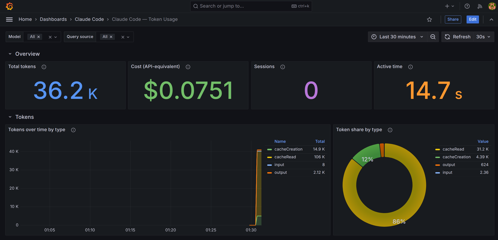

# How I Built a Local Observability Stack for Claude Code — by Pairing With an AI Agent

*Not "AI wrote my code." The honest version: what the agent did brilliantly, where it was confidently wrong, and what I had to bring to the table.*

---

I wanted to see something I couldn't see: how many tokens Claude Code was actually burning as I worked. On a subscription there's no invoice, so the usage was invisible — and invisible is a bad property for anything you're trying to get good at.

So I decided to build a local observability stack for it. But the interesting part of this story isn't the stack. It's *how* I built it: I paired with an AI coding agent (Claude Code itself) from the first prompt to the final `git push`, and treated it less like a code generator and more like a fast, tireless collaborator that I had to direct, fact-check, and occasionally overrule.

This is a post about that collaboration. The final product — an OpenTelemetry Collector, Prometheus, and Grafana stack that turns Claude Code's telemetry into a private dashboard — is open source at **[github.com/mrcrdg/claude-telemetry](https://github.com/mrcrdg/claude-telemetry)**. But what I actually want to share is the workflow, because "I built this with AI" is a phrase that's doing a lot of hiding these days, and I think the details are where the real skill lives.



## Starting with a spec, not a vibe

The first thing I learned: the quality of what the agent builds is bounded by the quality of what you ask for. I didn't say "make me a dashboard." I gave it a spec — the four services I wanted, the constraint that everything stay on `localhost` with no cloud, the exact Claude Code environment variables, the metric names, and one opinionated product decision: **lead with tokens, treat cost as secondary**, because on a subscription the "cost" figure is API-equivalent pricing, not a real bill.

That last decision mattered. Left to its own defaults, an AI will happily build a cost-centric dashboard because that's what most observability examples look like. The framing — *what story should this tool tell?* — was mine to make. The agent's job was to execute it well, and it did: within a couple of minutes it had scaffolded the Compose file, the collector config, the Prometheus scrape config, and a provisioned Grafana dashboard as checked-in JSON.

That speed is real and worth respecting. What would have been an afternoon of copying snippets from five different docs pages was a few minutes. But speed is exactly why the *checking* matters more, not less.

## Where the agent genuinely shone: making it verify itself

The best moment early on wasn't code generation — it was verification. Before writing the config, the agent spun up a separate sub-agent whose only job was to read the current Claude Code telemetry docs and confirm the details: the exact metric names, the attributes, the default export behavior.

That check paid for itself immediately. It came back with a correction I'd never have caught on my own: Claude Code exports metrics with **delta** temporality by default, but Prometheus is built for **cumulative** counters. Feed Prometheus delta data and it quietly does the wrong thing — counters that never accumulate, panels that look flat or empty, no error anywhere. The fix was a single environment variable:

```bash
OTEL_EXPORTER_OTLP_METRICS_TEMPORALITY_PREFERENCE=cumulative
```

One line. Completely invisible until you know to look for it. I would have burned an evening on that. The agent caught it before a single container was running — because I'd asked it to verify against the docs rather than trust its own memory.

Lesson one: **make the AI check its work against a source of truth, and it becomes dramatically more reliable.**

## Where the agent was confidently wrong: reality beats reasoning

Then came the moment that taught me the most.

Early on, the agent made a claim — clearly, confidently — that disabling a particular collector setting (`resource_to_telemetry_conversion`) would keep identifying information out of my metrics. It had a clean, plausible line of reasoning for it. I believed it. It sounded right.

It was wrong.

When we finally got real data flowing and I actually looked at the bytes coming out of the collector, every single metric looked like this:

```
claude_code_token_usage{model="claude-opus-4-8", type="input",
  query_source="main", user_email="me@example.com",
  user_id="95b1...", organization_id="d807...", ...} 6093
```

My email. On every series. The agent's tidy explanation had been about *resource* attributes — but Claude Code attaches this identifying data as *data-point* attributes, so the setting it pointed to never touched them. The reasoning was coherent and the reasoning was false, and the only thing that exposed the gap was checking against reality instead of against the model's story about reality.

We fixed it properly with a `labeldrop` rule at scrape time:

```yaml
metric_relabel_configs:
  - regex: "user_email|user_id|user_account_id|user_account_uuid|organization_id"
    action: labeldrop
```

And — the subtle part — we deliberately *kept* `session_id`, even though it looks equally "identifying," because it's structurally load-bearing: it's what keeps each session's cumulative counters as separate series so `increase()` handles restarts correctly. Drop it and you corrupt every rate calculation. Two labels that look identical, opposite treatment. Telling them apart is the actual data-modeling work, and it's the kind of judgment the human has to hold.

Lesson two: **an AI's confidence is not evidence. Verify outputs against ground truth — especially the confident ones.** The agent even went back and corrected its own earlier explanation in the code comments and docs once the real behavior was clear, which is exactly the loop you want: reality → correction → propagate the fix everywhere.

## The debugging duet

When I first opened Grafana, it was empty. This is where pairing with an agent feels less like using a tool and more like actually working with someone. It traced the pipeline hop by hop — is the collector receiving anything? is Prometheus scraping successfully? — and even injected a synthetic test metric to prove the stack itself was healthy end to end. That isolated the problem cleanly: the stack was perfect; the issue was on my side. I hadn't launched Claude Code from the same shell where I'd set the telemetry variables, so it was never exporting.

The agent ran the diagnostics; I confirmed the fix on my machine. Neither of us could have closed it alone — it couldn't see my terminal, I couldn't be bothered to manually curl five endpoints. Division of labor.

## The decisions that stayed mine

Throughout, there was a clear line between what the agent handled and what I owned. It advised; I decided:

- **Open-sourcing it.** Before publishing, I had it scan the whole repo and git history for anything sensitive. It flagged that my personal email was in the commit metadata — so I had it rewrite the history to a GitHub noreply address. Its job was to surface the risk and do the mechanical work; the decision to publish, and how, was mine.
- **Licensing.** MIT, with an explicit "not affiliated with Anthropic" note. The agent drafted it; I chose it.
- **What goes on my résumé.** When I asked how to describe the project, it pushed back on inflating it with a fabricated usage number — and instead helped me frame the real engineering substance honestly. I appreciated that it argued *against* the more impressive-sounding option.

That's the pattern I kept coming back to: the agent is extraordinary at execution, verification, and breadth. The framing, the constraints, the risk tolerance, and the calls with real-world consequences stayed with me. That's not a limitation to apologize for — it's the job.

## What I actually learned about building with AI

If I compress the whole experience into advice:

1. **Specify like you mean it.** Constraints and product decisions up front shape everything downstream. Vague in, generic out.
2. **Make it verify against sources, not memory.** The single best move I made was having it fact-check the docs before building.
3. **Check the confident claims hardest.** The most plausible-sounding output was the one that was wrong. Reality is the referee.
4. **Own the decisions.** Publishing, privacy, licensing, how you represent your own work — the AI can inform these, but they're yours.

The result is a tool I genuinely use, built faster than I could have alone, and correct in ways I *verified* rather than assumed. That combination — the leverage of the agent plus the judgment to direct and audit it — is, I think, the actual skill worth developing right now. Not "AI writes my code." More like: I know how to run a good collaboration where one of the collaborators happens to be a machine that's brilliant, fast, and occasionally, confidently wrong.

## Try it

```bash
git clone https://github.com/mrcrdg/claude-telemetry
cd claude-telemetry
docker compose up -d
source ./claude-env.sh && claude
# open http://localhost:3000
```

It's MIT-licensed and independent (not affiliated with Anthropic). If you build on it — or if you've got your own stories about where an AI agent was brilliant and where it was confidently wrong — I'd love to hear them.
